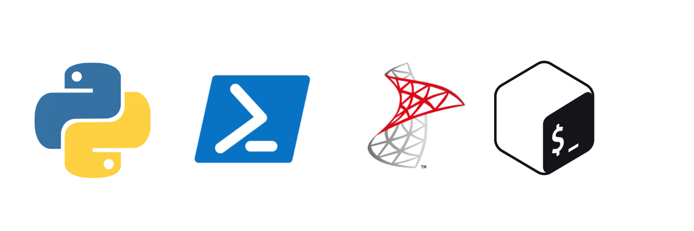

## SQL server Code for Projects

This is a space dedicated for SQL Server code provided or explained in the blog,
as a free resources to utilize without any restrictions.

## The purpose is mainly to support with extra material given in blog. 
The code used in this space is made mainly TSQL, with support in PoSH Json, or Terminal, depeding the requirements 
of the project made.

